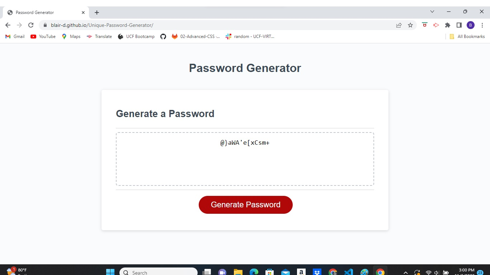

# Unique-Password-Generator
*Deployed Application:* https://blair-d.github.io/Unique-Password-Generator/

#DESCRIPTION
The motivation for this project was to create a userinterface that will generate ramdom passwords. The criteria for the composition of the password would be given to the user to decide, making it more unique and personal preference. The website allows the user to choose a passsword legnth from 8 to 128 characters. Also, the user is able to choose what categories of characters to incoporate, from uppercase, lowercase, numbers, and special characters. 

To use this website, click on the red generate password button then follow the promts. Click "OK" to add or continue, and click "Cancel" to decline. Select at the passsword legnth first, 8 - 128 characters. Next select at least 1 category of characters, uppercase, lowercase, numbers, or special characters. The password will automatically generate a password for you with the parameters set in the box. Enjoy your new password!

 
